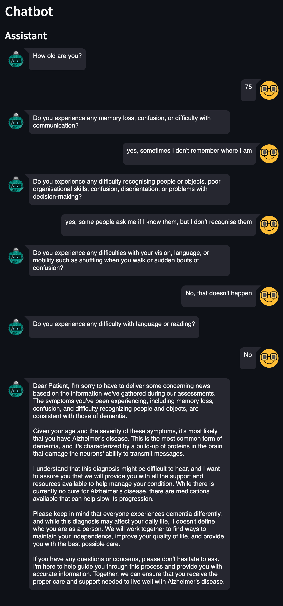
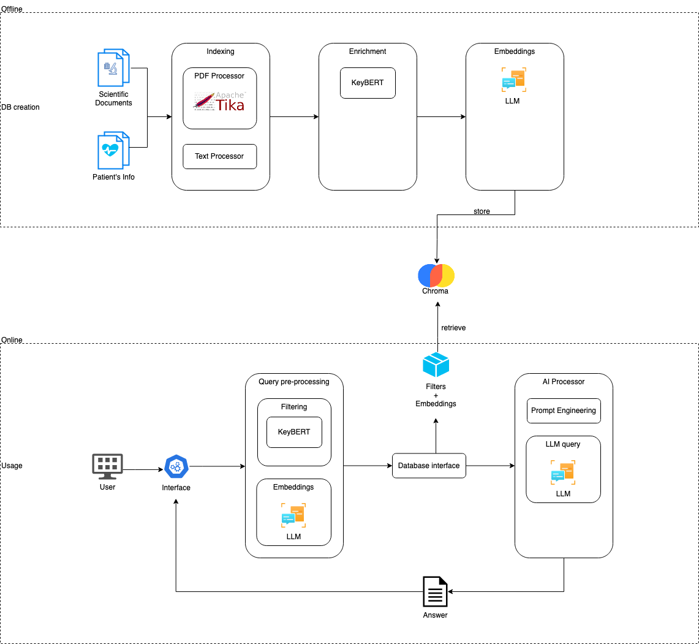

# LLM-RAG-ChatBot

LLM-based chatbot using Retrieval-Augmented Generation (RAG) to give answers based on local files.

Use case: evaluate if a person shows signs of dementia.

Status: **WORK IN PROGRESS!**

- [Overview](#overview)
- [Design](#design)
  - [Overall architecture](#overall-architecture)
  - [Functional flow](#functional-flow)
- [Setup](#setup)
  - [Ollama](#ollama)
  - [Python and the application](#python-and-the-application)
  - [Configuration](#configuration)
  - [Database creation](#database-creation)
- [Usage](#usage)

## Overview

The chatbot interviews the patient and formulates a diagnosis when there are sufficient elements to give advice.

The LLM is enriched with a local customisable knowledge base describing the symptoms. All experiments used dementia as a use case (vascular dementia, Alzheimer's disease, Lewy body dementia, and frontotemporal dementia).

In the current version, except for the first one, all questions are generated by the LLM that reacts to the dialogue. The dialogue is the base for determining the likelihood of dementia in the patient.

The main loop is as follows:

- Generate a question based on the current dialogue and the knowledge.
- Get the patient's answer.
- Translate the dialogue into a description of the patient.
- Attempt a diagnosis.
- If no diagnosis is possible and the maximum number of questions is not reached, repeat.
- If the maximum number of questions is reached, close without a diagnosis.

All parameters, including prompts, language model, parameters for the diagnosis, and knowledge, are fully customisable.

This is an example of a complete chat:

> This is based on the current version.



In the final loop, the dialogue is summarised by the LLM as follows:

```text
The patient is a 75-year-old individual who experiences memory loss, confusion, and difficulty recognizing people and 
objects, suggesting possible cognitive impairment.
```

The LLM formulates the following diagnosis:

```text
{
  "Number": 3,
  "Severity": 0.8,
  "Confidence": 0.9,
  "Explanation": "The patient exhibits three symptoms of cognitive impairment: memory loss, confusion, and difficulty 
                  recognizing people and objects. Based on the context provided, Alzheimer's disease or vascular 
                  dementia are potential diagnoses. Given the age of the patient, Alzheimer's disease is a more likely 
                  candidate. The severity of these symptoms suggests an advanced stage of cognitive impairment.",
}
```

- Number: number of symptoms identified in the patient.
- Severity: LLM's evaluation of the severity (0 to 1).
- Confidence: LLM's self-assessment (0 to 1).
- Explanation: LLM's reasoning.

The diagnosis follows these rules:

- minimum 5 questions. This number is arbitrary, but it must be greater than 1 to prevent bias.
- minimum confidence: 0.5
- minimum number of symptoms: 3
- score = severity * number of symptoms * confidence
- minimum score: 1.5

> Note: the numbers above are arbitrary.

If all conditions are met, the LLM's explanation is translated in a friendlier message for the patient. 

## Design

### Overall architecture

> This is not fully implemented yet.



### Functional flow
 


## Setup

### Ollama

The application uses [Ollama](https://ollama.com/) to run the LLM. 
Ollama can be downloaded from [the official website](https://ollama.com/download),
from its [GitHub repository](https://github.com/ollama/ollama),
or installed with packet managers such as [Homebrew](https://brew.sh/) on Mac.

E.g. on Mac:
```shell
brew install ollama
```

After the installation, run Ollama and download [Mistral](https://mistral.ai/).

E.g. on Mac:
```shell
ollama serve &
ollama pull mistral
```

It is possible to run [Ollama in Docker](https://hub.docker.com/r/ollama/ollama),
however the hardware acceleration may not work properly.
Without acceleration, the system is essentially unusable.
In [docker/ollama](docker/ollama) there is an example of Dockerfile to prepare the image. 

### Python and the application

The application was written and tested with [Python 3.10.13](https://www.python.org/downloads/).
Python 3.11 was ignored because some dependencies did not support it at the time.

[PyCharm](https://www.jetbrains.com/pycharm/) was chosen as IDE, but it is only a personal preference.

Create a [virtual environment](https://docs.python.org/3/library/venv.html) and activate it.

E.g. on Mac:
```shell
python -m venv /path/to/new/virtual/environment
source /path/to/new/virtual/environment/bin/activate
```

Install all the required libraries:
```shell
pip install -r requirements.txt
```

### Configuration

Edit [config/config.json](config/config.json).

- collection: identifies the name of the collection of documents around a topic.
- dbPath: this is the path where the database is located or where it will be created.
- dbLoader: configuration for the build_db script
  - sourceExtension: acceptable file extension (e.g. ".txt")
  - sourceFolder: source folder for the documents
- diagnosis: these are a collection of parameters to calibrate the diagnosis step:
  - minimum_number_of_questions: minimum number of questions before the diagnosis.
  - maximum_number_of_questions: after that number, the application will give a negative diagnosis.
  - minimum_confidence: the LLM self-evaluate its confidence about its opinion between 0 and 1.
  - minimum_number_of_symptoms: minimum number of symptoms to give a positive diagnosis.
  - minimum_score: the score is `confidence * symptoms * severity`. The severity is calculated internally by the LLM.
  - negative_diagnosis: description of the negative diagnosis. The LLM will adapt it to the dialogue.
- model: please find model names on the [Ollama's website](https://ollama.com/library). 
  Please note that different models perform differently, may require different prompts, and must be installed in
  locally in Ollama.
- prompts: configuration of the prompts.
  - chat: these are the prompts used to continue the dialogue.
  - summary: these are the prompts to extract the patient's description from the dialogue.
  - diagnosis: these are the prompts to extract a JSON with the metrics to perform a diagnosis. The metrics are used
    programmatically to decide how to proceed.
  - final_diagnosis: in case of positive diagnosis, these prompts translate the diagnosis into a dialogue with the
    patient.

### Database creation

Verify the content in the path indicated in `config.json` under `dbLoader.sourceFolder`.

The included content was extracted from:

> Dementia UK (2023) "What is dementia?".
  Available from [https://www.dementiauk.org](https://www.dementiauk.org/information-and-support/about-dementia/what-is-dementia/).
  [Accessed 16/03/2024]

To load the content run:
```shell
python chatbot/build_db.py
```

The output will be a database in the location specified in `config.json` under `dbPath`.
The configuration is shared between the `build.db` script and the application, so it will be consistent.

## Usage

Run the application with:
```shell
python -m streamlit run chatbot/app.py
```

The browser should automatically open [http://localhost:8501/](http://localhost:8501/)
