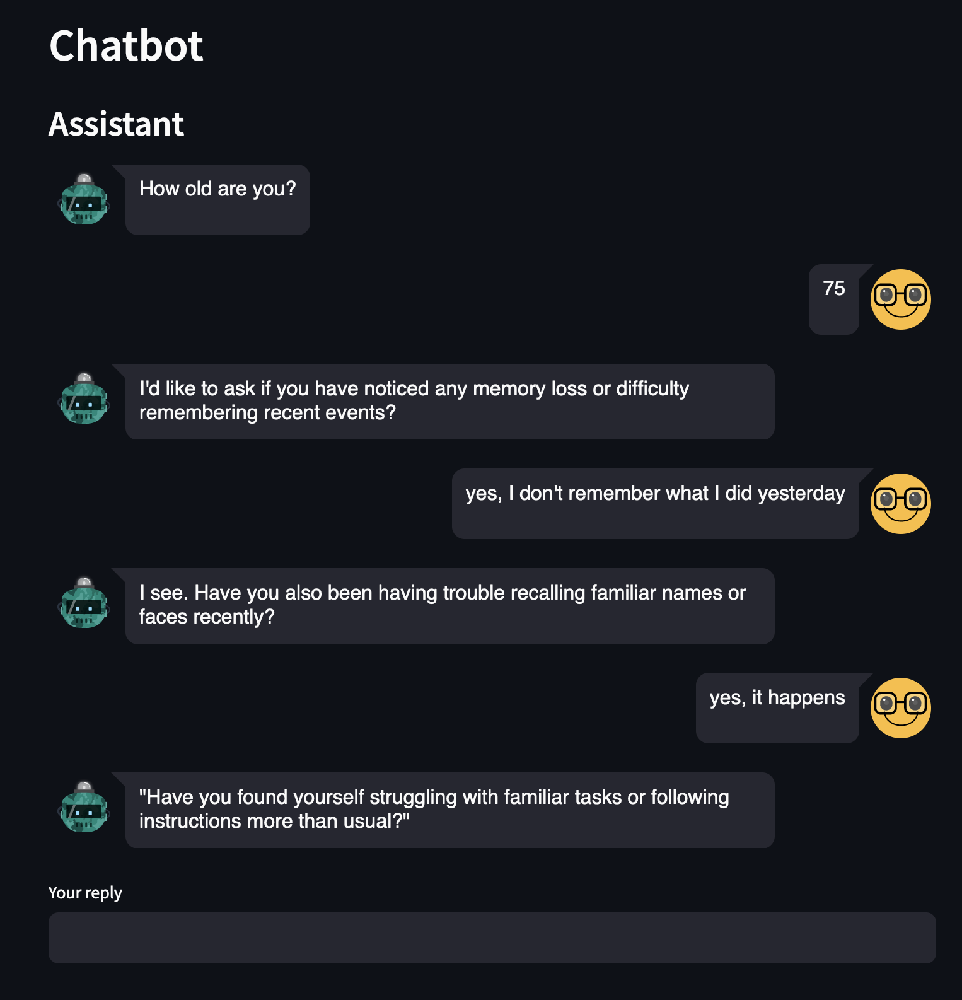
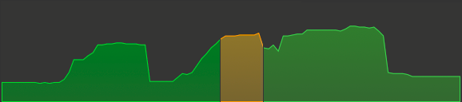

# LLM-RAG-ChatBot

LLM-based chatbot using Retrieval-Augmented Generation (RAG) to give answers based on local files.

Use case: evaluate if a person shows signs of dementia.

Status: **WORK IN PROGRESS!**

- [Overview](#overview)
- [Design](#design)
  - [Overall architecture](#overall-architecture)
  - [Functional flow](#functional-flow)
- [Setup](#setup)
- [Usage](#usage)
- [Performance](#performance)

## Overview

The chatbot interviews the patient and formulates a diagnosis when there are sufficient elements to give advice.

The LLM is enriched with a local customisable knowledge base describing the symptoms. All experiments used dementia as a use case (vascular dementia, Alzheimer's disease, Lewy body dementia, and frontotemporal dementia).

In the current version, except for the first one, all questions are generated by the LLM that reacts to the dialogue. The dialogue is the base for determining the likelihood of dementia in the patient.

The main loop is as follows:

- Generate a question based on the current dialogue and the knowledge.
- Get the patient's answer.
- Translate the dialogue into a description of the patient.
- Attempt a diagnosis.
- If no diagnosis is possible and the maximum number of questions is not reached, repeat.
- If the maximum number of questions is reached, close without a diagnosis.

All parameters, including prompts, language model, parameters for the diagnosis, and knowledge, are fully customisable.

This is an example of a complete chat:

> This is based on the current version.



In the final loop, the dialogue is summarised by the LLM as follows:

```text
The patient is a 75-year-old individual who experiences memory loss, confusion, and difficulty recognizing people and 
objects, suggesting possible cognitive impairment.
```

The LLM formulates the following diagnosis:

```text
{
  "Number": 3,
  "Severity": 0.8,
  "Confidence": 0.9,
  "Explanation": "The patient exhibits three symptoms of cognitive impairment: memory loss, confusion, and difficulty 
                  recognizing people and objects. Based on the context provided, Alzheimer's disease or vascular 
                  dementia are potential diagnoses. Given the age of the patient, Alzheimer's disease is a more likely 
                  candidate. The severity of these symptoms suggests an advanced stage of cognitive impairment.",
}
```

- Number: number of symptoms identified in the patient.
- Severity: LLM's evaluation of the severity (0 to 1).
- Confidence: LLM's self-assessment (0 to 1).
- Explanation: LLM's reasoning.

The diagnosis follows these rules:

- minimum 5 questions. This number is arbitrary, but it must be greater than 1 to prevent bias.
- minimum confidence: 0.5
- minimum number of symptoms: 3
- score = severity * number of symptoms * confidence
- minimum score: 1.5

> Note: the numbers above are arbitrary.

If all conditions are met, the LLM's explanation is translated in a friendlier message for the patient. 

## Design

### Overall architecture

> This is not fully implemented yet.


### Functional flow

> This is not fully implemented yet.
 


## Setup

`pip install -r requirements.txt`

## Usage

Store txt documents in `./kb`.

Start Ollama with

```shell
ollama serve
```

Build the Db with

```shell
python BuildDb.py
```

Run the application with

```shell
python -m streamlit run app.py
```

Connect with a browser to [http://localhost:8501/](http://localhost:8501/).

## Performance

Tested with 107 files in markdown for a total of 596K, on Mac M1 with 32 GB of RAM.

The application is memory intensive and the answer may take 30+ seconds.

The following diagram shows the memory pressure during a query. The phases of document search and answer generation are clearly visible.



